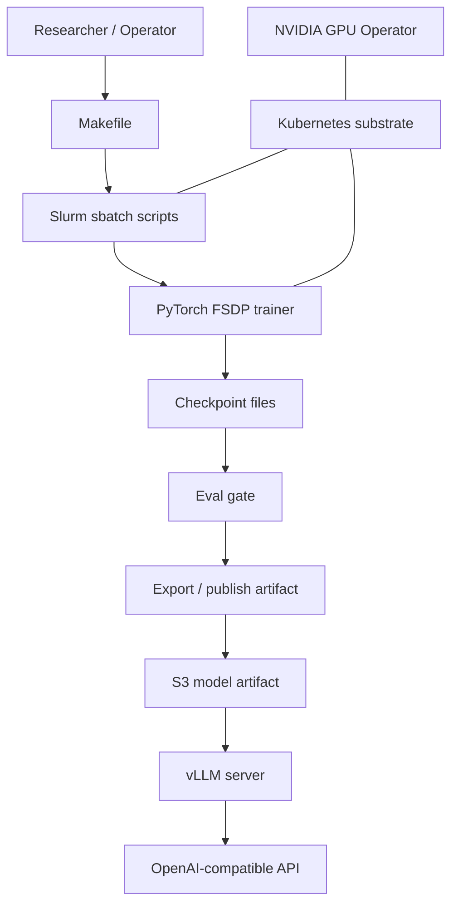
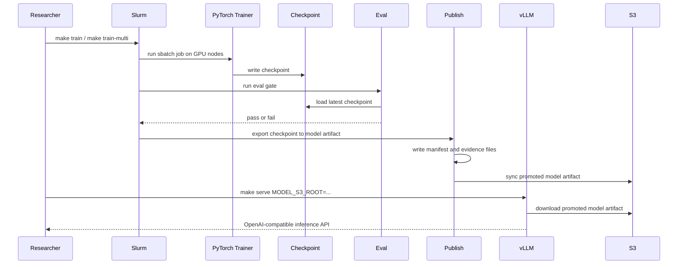

# Project Overview

This repo is a GPU training and serving control plane.

The purpose is to show that you can run a real multi-node GPU system with:

- Slurm as the researcher-facing scheduler
- PyTorch FSDP for distributed training
- checkpointing and recovery
- evaluation gates
- export and promotion of trained artifacts
- vLLM serving for inference
- CloudWatch-backed observability in the infrastructure layer
- Kubernetes only as the substrate layer, not as the job scheduler

The project is not trying to be a general application platform. It is trying to prove that you can operate the training and release path for GPU models in a way that looks like a serious lab or cloud platform.

## What This Repo Proves

- You can provision GPU infrastructure.
- You can bootstrap a Slurm cluster.
- You can run multi-node training with FSDP.
- You can save and restore checkpoints.
- You can evaluate checkpoints automatically.
- You can export a trained checkpoint into a serveable model artifact.
- You can publish that artifact to S3.
- You can serve the promoted artifact with vLLM.

## The Main Layers

```text
                +----------------------+
                |   Researcher / User   |
                +----------+-----------+
                           |
                           v
                +----------------------+
                |    Makefile / CLI     |
                +----------+-----------+
                           |
                           v
                +----------------------+
                |   Slurm sbatch jobs   |
                +----+-----------+------+
                     |           |
                     |           v
                     |   +----------------------+
                     |   |  Eval / Export /      |
                     |   |  Publish / Serve      |
                     |   +----------+-----------+
                     |              |
                     v              v
        +-------------------+   +----------------------+
        | PyTorch FSDP      |   | vLLM serving         |
        | training loop     |   | OpenAI-compatible API|
        +---------+---------+   +----------+-----------+
                  |                        |
                  v                        v
        +-------------------+   +----------------------+
        | Checkpoints       |   | Promoted artifacts   |
        | raw training state|   | Hugging Face-style   |
        +---------+---------+   | model directory      |
                  |             +----------+-----------+
                  v                        |
        +-------------------+              v
        | S3 run root       |   +----------------------+
        | checkpoints/      |   | S3 run root          |
        +-------------------+   | models/latest        |
                                 +----------------------+

        Kubernetes substrate + NVIDIA GPU Operator run underneath the batch path.
        They provide node lifecycle, GPU enablement, and platform services.
        They do not schedule the training jobs.
```



## Runtime Flow



## Where The Important Pieces Live

- `slurm/` - job scripts for train, eval, recovery, and serve
- `training/fsdp_trainer.py` - actual distributed training loop
- `checkpoint/async_writer.py` - checkpoint save and restore
- `training/export_model.py` - convert checkpoint to serveable model directory
- `training/publish_model.py` - export and publish the model artifact
- `eval/quality_gate.py` - perplexity gate on saved checkpoints
- `inference/server.py` - vLLM launcher
- `infra/` - Terraform, k3s bootstrap, and CloudWatch observability
- `docs/model-artifact-manifest.md` - artifact evidence format
- `ops-journal/` - proof records from real runs

## How To Read The Project

If you want the shortest mental model, read it in this order:

1. [README.md](../README.md)
2. [docs/nvidia-style-slurm-on-kubernetes.md](nvidia-style-slurm-on-kubernetes.md)
3. [docs/stage3-slurm-substrate-proof.md](stage3-slurm-substrate-proof.md)
4. [docs/model-artifact-manifest.md](model-artifact-manifest.md)
5. [ops-journal/index.md](../ops-journal/index.md)

That gives you the product thesis, the architecture choice, the proven validation path, and the evidence trail.

## One Sentence Summary

This repo proves a Slurm-first GPU training platform with a Kubernetes substrate, FSDP training, checkpoint recovery, evaluation gating, artifact promotion, and vLLM serving.
